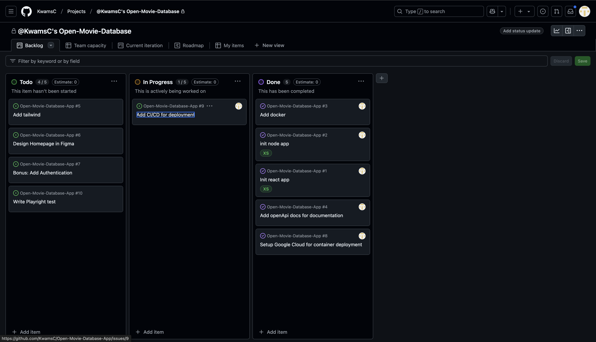

# Open-Movie-Database-App


A web application that allows users to search and explore movies using The Open Movie Database (OMDb) API. Users can search for movies and shows by title and year and view detailed information.

## ✨ Key Features
- 🔍 **Search Movies & Shows**: Real-time search
- 🎬 **Content Filtering**: Filter by year and media type (movies/shows)
- 📱 **Responsive Design**: Seamless experience across all devices
- ⚡️ **Performance**: Redis caching for fast responses
- 📚 **API Documentation**: Swagger documentation

## 🛠 Tech Stack

### Frontend
- React 18 with Vite
- TypeScript for type safety
- TailwindCSS for styling
- Framer Motion for animations

### Backend
- NodeJS
- ExpressJS
- Swagger (OpenAPI documentation)
- Redis

## 🔑 Setup

### Prerequisites
- Node.js (v23.6.1)
- Redis
- OMDB API key


### Setup environment
To run the application, create an `.env` file in the root directory, which can be created by running this script `npm run setup:env`. 

Add your own `API_KEY`, which you can generate and obtain from the [The Open Movie Database](https://www.omdbapi.com/)

If you have `nvm` installed, run the following command to get the right node version, otherwise install the node version 23.6.1

```bash
nvm install

# Install backend dependencies
npm install

# Install frontend dependencies
cd movieDb-app
npm install

# add env keys to environment
npm run setup:env
```

### Setup redis
If you have `homebrew` installed, run the following command to

```bash
# Install Redis
brew install redis

# Start Redis service
brew services start redis

# Verify Redis is running
brew services list | grep redis
```

## 🚀 Run application

Build the frontend application and run the backend application to start the app

```bash
# Build frontend to load static files in backend (from movieDb-app)
cd movieDb-app
npm run build

# Start backend (from root)
npm run dev
```

## 📚 API Documentation
The API documentation is available at `/docs` endpoint when running the application. The backend provides two main endpoints:
- `GET /api/v1/search` - Search movies with filters
- `GET /api/v1/movies/{id}` - Get detailed information about a specific movie

## 🧪 Testing

```bash
# Integration test api's
npm run test

# E2E test
cd movieDb-app
npm run test:e2e
```

## Project Considerations

*Project organisation*

This application is containerized with Docker, combining both frontend and backend in a single container. The NodeJS/Express backend serves the static files built with ReactJS.

This made it easier to deploy to a managed service like GCP, Azure, AWS etc.
I chose GCP because I started using it last year and the free tier was generous.
Based on the amount of users and load, the number of instances can be increased if we hit limits. I started with a cold start (0 instances) to not drive cost.

I made a design based on mockup made by Arfi Moulana found on [Dribbble](https://dribbble.com/shots/21891328-Steary-Stream-App-Spatial-UI-Concept)


I Would have loved to add users and favourite list to it, but because of the time constraint. I decided to focus on making the app production ready and deploy it.